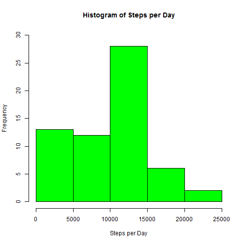
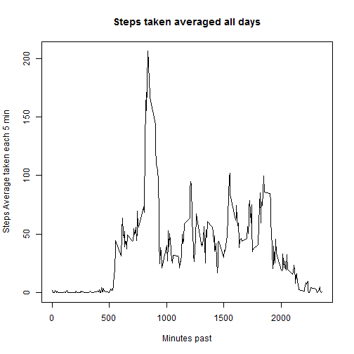
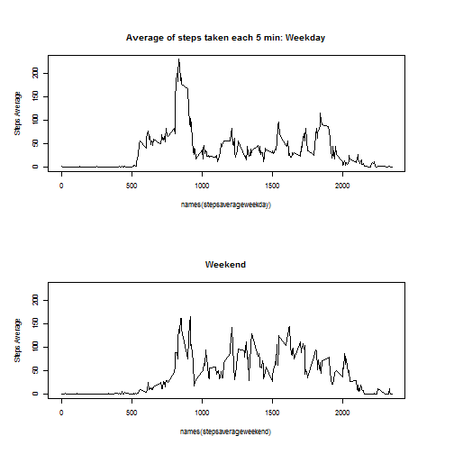

###Loading and preprocessing the data

1. Loading the data

```r
activity <- read.csv("activity.csv")
```

2. Processing the data: converting the character variable "date" as Date format

```r
activity$date <- as.Date(as.character(activity$date))
```

###Total number of steps taken per day

1. Calculating the total number of steps taken per day

```r
stepsperday <- tapply(activity$steps, activity$date, sum, na.rm= TRUE)
```

2. Histogram of the total number of steps taken each day

```r
hist(stepsperday, col = "green", xlab = "Steps per Day", main = "Histogram of Steps per Day", ylim = c(0,30))
```

 

3. Calculating and reporting the mean and median of the total number of steps taken per day

```r
summary(stepsperday)
```

```
##    Min. 1st Qu.  Median    Mean 3rd Qu.    Max. 
##       0    6778   10400    9354   12810   21190
```

###Average daily activity pattern

1. Time series plot of the 5-minute interval (x-axis) and the average number of steps taken, averaged across all days (y-axis)

```r
stepsaverage <- tapply(activity$steps, activity$interval, mean, na.rm= TRUE)
plot(names(stepsaverage), stepsaverage, type= "l", xlab = "Minutes past", ylab = "Steps Average taken each 5 min", main = "Steps taken averaged all days")
```

 

2. 5-minute interval, on average across all the days in the dataset, that contains the maximum number of steps:

```r
which.max(stepsaverage)
```

```
## 835 
## 104
```

###Imputing missing values

1. Calculating and reporting the total number of missing values in the dataset

```r
sum(is.na(activity$steps))
```

```
## [1] 2304
```

2. Code to describe and show a strategy for imputing missing data. Create a new dataset that is equal to the original dataset but with the missing data filled in

```r
activityimp <- activity
id <- dim(activityimp)[1]
for (i in 1:id){
        if (is.na(activityimp$steps[i])){
                int = activityimp$interval[i]
                activityimp$steps[i] = as.vector(stepsaverage[names(stepsaverage)==int])
        }
}
```

3. Making a histogram of the total number of steps taken each day and calculating and reporting the mean and median total number of steps taken per day.

```r
stepsperdayimp <- tapply(activityimp$steps, activityimp$date, sum, na.rm= TRUE)
hist(stepsperdayimp, col = "green", xlab = "Steps per Day", main = "Histogram of Steps per Day (with imputing missing data)")
```

 

```r
summary(stepsperdayimp)
```

```
##    Min. 1st Qu.  Median    Mean 3rd Qu.    Max. 
##      41    9819   10770   10770   12810   21190
```
As we can see above, the histogram shape for imputed missing data looks like a normal curve compared with the histogram with missing data. The mean and median are a little bit bigger.

###Differences in activity patterns between weekdays and weekends

1. Creating a new factor variable in the dataset with two levels - "weekday" and "weekend" indicating whether a given date is a weekday or weekend day

```r
activityimp$daytype <- sapply(activityimp$date, function(x) if(weekdays(x) %in% c("sábado", "domingo")) x <- "weekend" else x <- "weekday")
activityimp$daytype <- as.factor(activityimp$daytype)
```

2. Panel plot comparing the average number of steps taken per 5-minute interval across weekdays and weekends

```r
stepsaverageweekday <- tapply(activityimp$steps[activityimp$daytype=="weekday"], activityimp$interval[activityimp$daytype=="weekday"], mean, na.rm= TRUE)
stepsaverageweekend <- tapply(activityimp$steps[activityimp$daytype=="weekend"], activityimp$interval[activityimp$daytype=="weekend"], mean, na.rm= TRUE)
par(mfrow = c(2,1), cex = 0.7, pin = c(5.5,1.8))
plot(names(stepsaverageweekday), stepsaverageweekday, type= "l", ylab = "Steps Average", main = "Average of steps taken each 5 min: Weekday", ylim = c(0,230))
plot(names(stepsaverageweekend), stepsaverageweekend, type= "l", ylab = "Steps Average", main = "Weekend", ylim = c(0,230))
```

 

